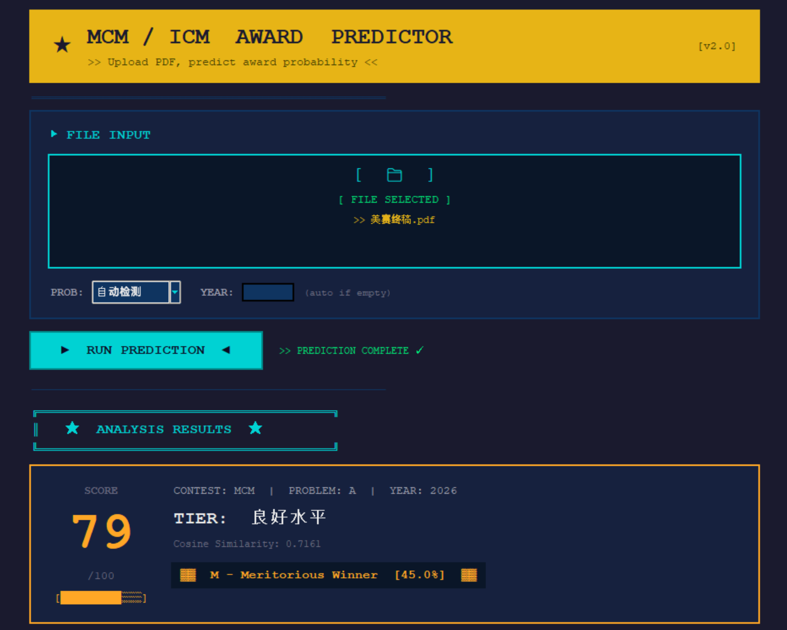
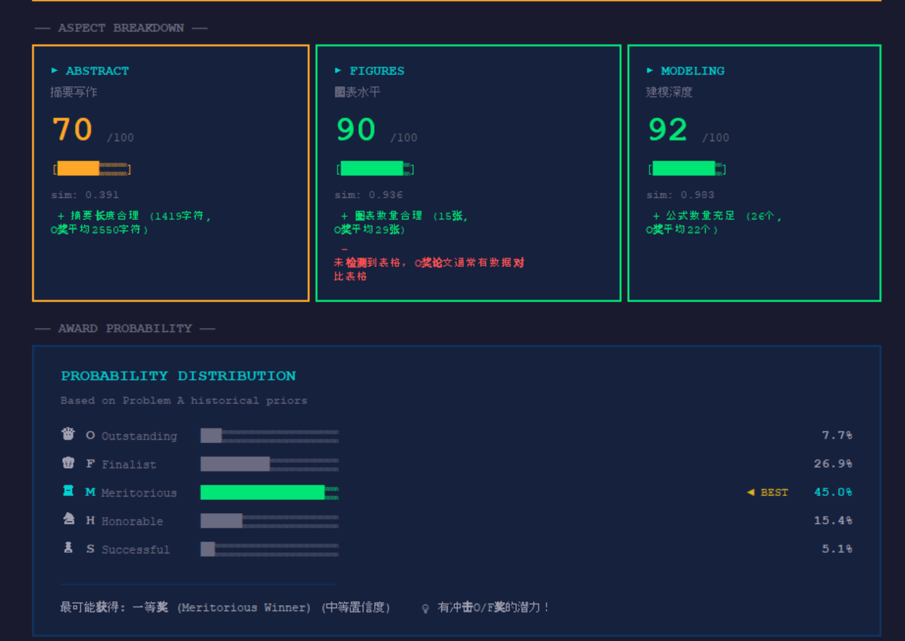
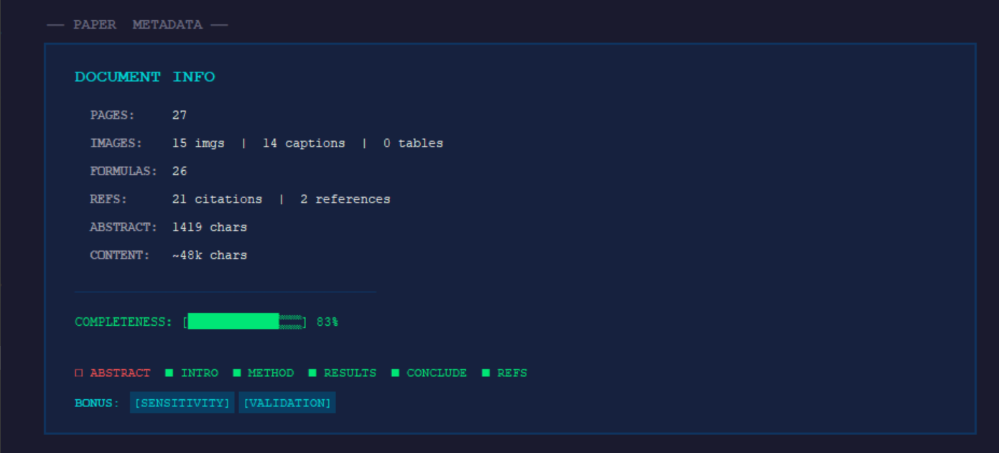

# 🏆 MCM/ICM 论文获奖预测器 (Award Predictor)

> **"玄学"与"科学"的完美结合，让你的建模论文不再迷茫！** 🔮✨
> 
> *Based on PyTorch, Sentence-Transformers & XGBoost*

   

---

## 📖 项目简介 (Introduction)

你是否在美赛（MCM/ICM）提交论文后焦急地等待结果？或者在训练时想知道自己的论文距离 **Outstanding Winner (O奖)** 还有多远？

本项目是一个基于**多模态特征融合**的论文质量评估系统。它不仅仅是数单词，而是真正地"读"懂你的论文：
1.  **看结构**：通过 `PyMuPDF` 解析你的排版、章节和公式密度。
2.  **读语义**：使用 `Sentence-Transformers` 将你的文本与历年 O 奖论文进行语义空间比对。
3.  **赏图片**：利用 `ResNet/CNN` 特征提取器（如果是深度学习模式）分析你的图表丰富度。
4.  **估概率**：最后通过贝叶斯推断和加权融合，告诉你获得 O/F/M/H/S 各奖项的概率！

---

## 📚 数据来源 (Data Source)

本项目的数据集（O奖论文）部分来源于开源项目：
*   **[https://github.com/Sumoothday/MCMICM](https://github.com/Sumoothday/MCMICM)** - 感谢 Sumoothday 整理的历年优秀论文集！

---

## ✨ 核心功能 (Features)

*   **🕵️‍♂️ 自动侦探 (Auto-Correction)**:
    *   自动识别论文的 **赛题 (Problem A-F)** 和 **年份**。
    *   不需要手动指定，丢进去就行！
*   **🧠 深度语义分析**:
    *   计算你的摘要、全文与该题历史上 O 奖论文的 *Cosine Similarity*。
    *   这可不是简单的关键词匹配，而是 Sentence-BERT 级别的语义理解。
*   **🎨 复古 GUI 风格**:
    *   **Retro Pixel (gui.py)**: 8-bit 复古像素风，极客的最爱，终端感十足。
*   **📊 多维评分**:
    *   不仅给出概率，还给出雷达图分析（结构分、逻辑分、图表分等）。

---

## 🖼️ 界面展示 (Screenshots)

### 像素复古风 (Pixel-Retro Style)
*文件名: `gui.py`*

> 📺 **复古终端机的感觉，每一次预测都像是在黑客帝国里敲代码。**
> 
> *以下展示了使用本工具预测我自己的参赛论文的真实运行结果：*

<table>
  <tr>
    <td align="center"></td>
  </tr>
  <tr>
    <td align="center"></td>
  </tr>
  <tr>
    <td align="center"></td>
  </tr>
</table>

---


## 🛠️ 安装与部署 (Installation)

### 1. 环境准备
确保你的 Python 版本 >= 3.9 (推荐 3.10)。

```bash
# 克隆仓库 (假设你已经弄下来了)
cd MCM-ICM-Prediction

# 创建虚拟环境 (强烈推荐，防止依赖打架)
python -m venv venv
# Windows 激活
.\venv\Scripts\activate
# Mac/Linux 激活
source venv/bin/activate
```

### 2. 安装依赖
如果是深度学习版，依赖可能比较重（PyTorch等）。

```bash
pip install -r requirements.txt
```

> ⚠️ **注意**: `torch` 如果下载慢，建议去 PyTorch 官网找对应 CUDA 版本的安装命令，或者使用国内镜像源。

---

## 🚀 快速开始 (Usage)

### 方式 A: 使用图形界面 (推荐 ⭐)

**喜欢复古像素风？**
```bash
python gui.py
```
*支持直接把 PDF 文件拖拽进窗口哦！*

### 方式 B: 命令行黑客 (CLI)

如果你想批量处理或者单纯喜欢黑底白字：

```bash
# 自动识别题目和年份
python predict_award.py path/to/your/paper.pdf

# 强制指定题目为 B 题，年份 2024
python predict_award.py path/to/your/paper.pdf --problem B --year 2024
```

---

## 🏗️ 项目结构 (Structure)

```text
MCM-ICM Prediction/
├── gui.py                  # 🎮 像素风 GUI 入口
├── predict_award.py        # 🔮 核心预测脚本 (CLI入口)
├── requirements.txt        # 📦 依赖列表
├── config.yaml             # ⚙️ 配置文件 (路径、权重等)
├── src/                    # 🧠 核心源码
│   ├── feature_fusion.py   # 特征融合逻辑
│   ├── text_features.py    # 文本语义特征提取 (S-BERT)
│   ├── image_features.py   # 图像特征提取
│   ├── probability_model_v2.py # 贝叶斯概率模型
│   └── problem_detector.py # 题目/年份检测器
├── scripts/                # 🛠️ 工具脚本
│   └── train_scoring_model.py # 训练模型
```

---

## 🤓 技术细节 (Tech Stack)

*   **PDF 解析**: `PyMuPDF (fitz)` - 快速提取文本、图片对象。
*   **NLP 模型**: `sentence-transformers` (all-MiniLM-L6-v2) - 轻量级但效果拔群的句向量模型。
*   **图像分析**: `Pillow` + `Torch` - 分析图表密度、色彩丰富度。
*   **机器学习**: `Scikit-learn` (Cosine Similarity) + 贝叶斯推断 - 将相似度转换为概率分布。
*   **GUI**: `Tkinter` + `TkinterDnD2` - 原生 Python GUI，零前端依赖。

---

## ⚠️ 免责声明 (Disclaimer)

*   本项目**主要用于辅助评估和学习**，预测结果仅供参考。
*   O 奖（Outstanding）是天时地利人和的产物，本模型基于历史数据的相似度进行推断，**不代表**评委的最终口味。
*   如果预测结果是 S 奖，不要灰心，说不定评委那天心情好呢？😉
*   如果预测结果是 O 奖，苟富贵，勿相忘！

---

*Made with ❤️ by Matthew for the Math Modeling Community.*
